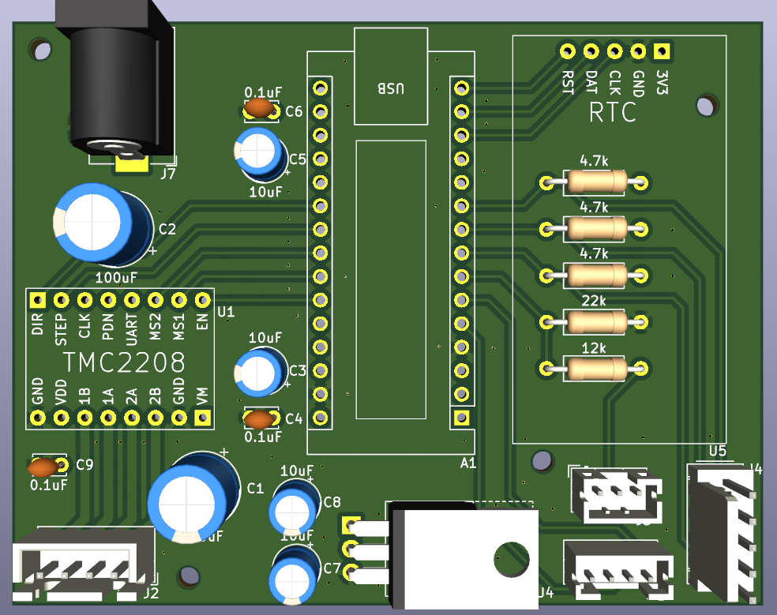
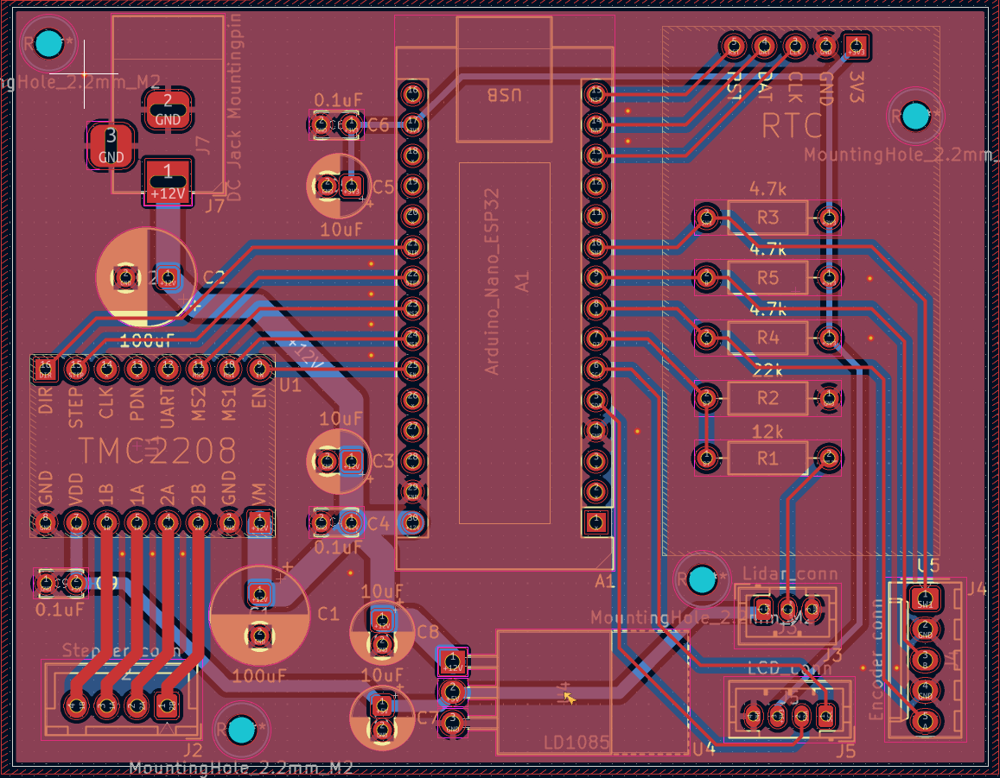
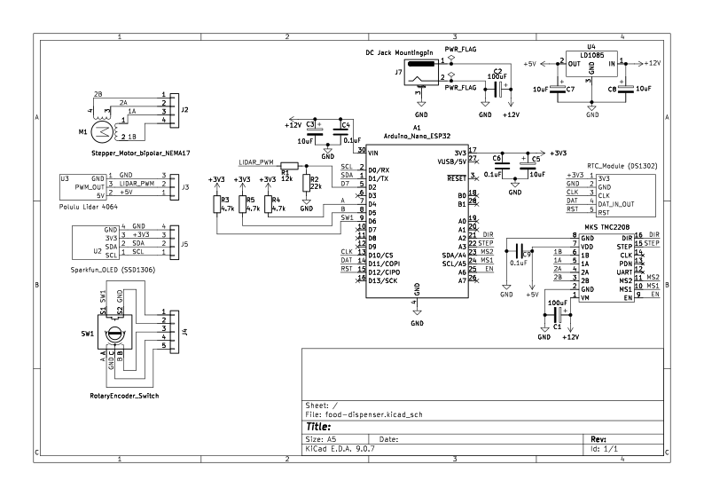

# Automatic Food Dispenser

Firmware for an Arduino Nano ESP32-based automatic cat food dispenser. Controls a stepper motor to dispense food on a configurable schedule. Can be controlled from a phone using the companion app:
[https://github.com/W-illum/food-dispenser-app/](https://github.com/W-illum/food-dispenser-app/)

---

## Overview

The feeder runs on an Arduino Nano ESP32 and exposes a GATT BLE service. All feeding logic lives on the device, the app is purely a remote control. It can also be operated standalone using the rotary encoder and OLED display on the device itself. The hardware is built on a custom 2-layer PCB designed in KiCad.

---

## Features

- **Scheduled feeding** - stores up to 4 feeding times in EEPROM, executed automatically via RTC
- **OLED display & rotary encoder** - fully standalone control without a phone
- **BLE control** - exposes a GATT service for remote control via the companion app
- **Manual feed** - dispense food on demand over BLE
- **Food level sensing** - LiDAR-based food level monitoring
- **Stepper motor control** - TMC driver with timer-ISR driven stepping

---

## Hardware

- Arduino Nano ESP32
- TMC stepper driver
- Nema stepper motor
- DS1302 RTC
- SparkFun Qwiic OLED display
- Rotary encoder
- LiDAR food level sensor

---

## Tech Stack

- [PlatformIO](https://platformio.org) / Arduino framework
- [NimBLE-Arduino](https://github.com/h2zero/NimBLE-Arduino) - BLE stack
- C++